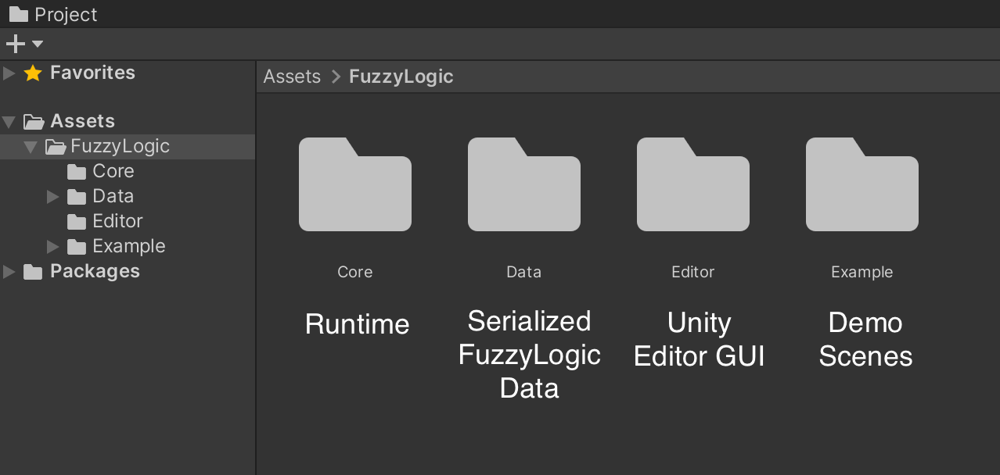
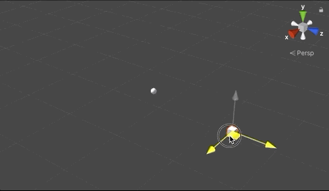
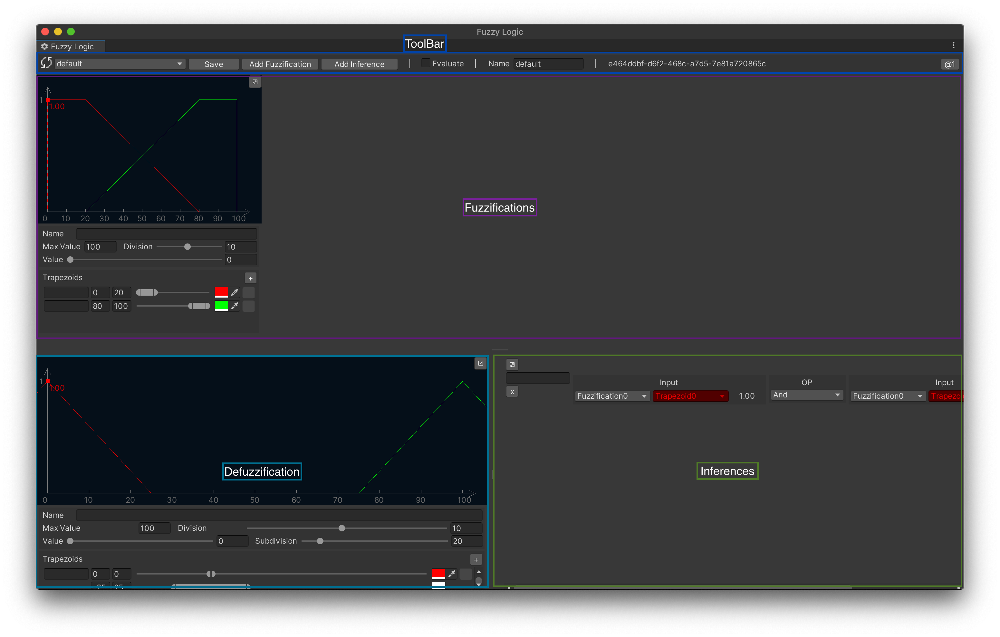
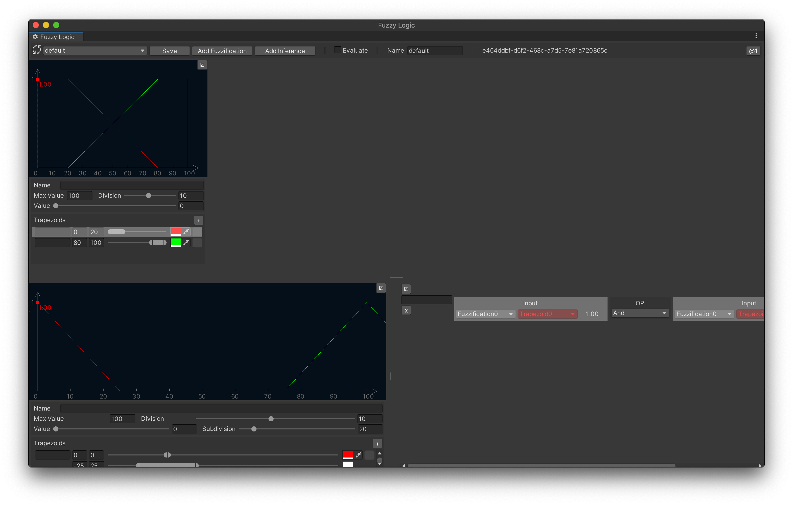
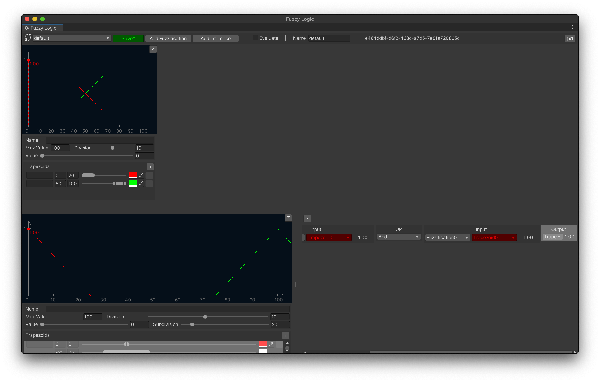
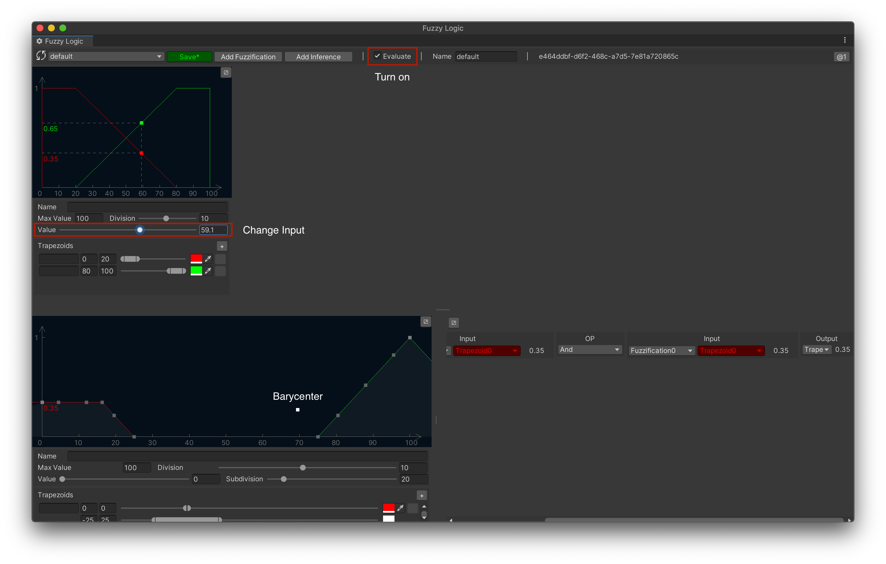
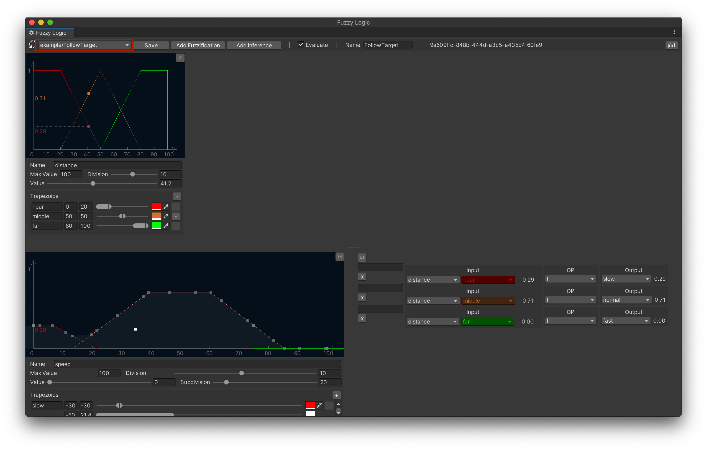

# FuzzyLogic

[](https://opensource.org/licenses/MIT)
[](https://github.com/chengkehan/FuzzyLogic/releases)

A fuzzy logic implementation with c# and friendly ui in Unity.

## Motivation

I'd like to add a usable FuzzyLogic System into my game, but after I searched all around Internet, I still can't find any one. FuzzyLogic module in Mathlab is very powerful, I can bake output to a file and read it at runtime, but backed data is inflexible. Finally,  I decide to develop a simple FuzzyLogic System in Unity.  The core code is pure cSharp and independent of Unity.

## Project Structure



## Tested Version

* Unity 2020.3 LTS

## Propaedeutic

Before you go on reading, you should have some bacis knowledge about FuzzyLogic, just a little, not need too much.

I recommend you read Chapter 10 about Fuzzy Logic in a book named Programming Game AI by Example by Mat Buckland.

## Get Started

### Structure and Flow of My FuzzyLogic

Flow of a common function looks like this.

```
_______________     _______________    _______________
|             |     |             |    |             |
|    Input    o  -> i  Calculate  o -> i    Output   |
|_____________|     |_____________|    |_____________|

```

In FuzzyLogic, we call "Input" as "Fuzzification", "Calculate" as "Inference" or "Rule", and "Output" as "Defuzzification". Now, flow of a FuzzyLogic looks like this.

```
                       _________________
                       |               |
                    ---i Fuzzification o -----          _______________
                    |  |_______________|     |          |             |
                    |                        |     -----i  Inference  o-----
                    |  _________________     |     |    |_____________|    |     ___________________
                    |  |               |     |     |                       |     |                 |
     Application----|--i Fuzzification o-----|-----|                       |-----i Defuzzification o----Application
                    |  |_______________|     |     |    _______________    |     |_________________|
                    |                        |     |    |             |    |
                    |  _________________     |     -----i  Inference  o-----
                    |  |               |     |          |_____________|
                    ---i Fuzzification o------
                       |_______________|

```

We can have any number of Fuzzifications and any number of Inferences, but only one Defuzzification. Input of an Inference is from several Fuzzifications by any combination.  In Fact, output of Fuzzification to input of Inference is not the only one choice, we can also use output of another Inference as input of this Inference. Similarly, output of another FuzzyLogic is also can be used as input of Inference or Fuzzification. 

```
                ----------------->------------------
______________  |      _________________           |
|            |  |      |               |           |
| FuzzyLogic o--|   ---i Fuzzification o -----     |    _______________
|____________|  |   |  |_______________|     |     |    |             |
                v   |                        |     |-->-i  Inference  o-----
                |   |  _________________     |     |  | |_____________|    |     ___________________
                |   |  |               |     |     |  |                    |     |                 |
    Application->---|--i Fuzzification o-----|-->--|  ---------<-------<-  |-->--i Defuzzification o----Application
                    |  |_______________|     |     |    _______________ |  |     |_________________|
                    |                        |     |    |             | |  |
                    |  _________________     |     --->-i  Inference  o--->-
                    |  |               |     |          |_____________|
                    ---i Fuzzification o------
                       |_______________|
```

Let's zoom in Fuzzification, we can see more details about output of Fuzzification, there is not only one output, but several ones. There are some FuzzySets inside of Fuzzification, these FuzzySets provide actual output value. The same as Defuzzification.

```

       -----Fuzzification--------
       |                        |
       |  _________________     |
       |  |               |     |
       |  |    FuzzySet   o---  |
       |  |_______________|  |  |
       |                     |  |
       |  _________________  |  |
       |  |               |  |  |
  -----i  |    FuzzySet   o--|--O-------
       |  |_______________|  |  |
       |                     |  |
       |  _________________  |  |
       |  |               |  |  |
       |  |    FuzzySet   o---  |
       |  |_______________|     |
       |                        |
       |________________________|
```
### FuzzySet

There are many type of FuzzySet in traditional FuzzyLogic, but in this FuzzyLogic only one type is supported. It's enough for regular case. We call it TrapezoidFuzzySet. It looks like this.

```
      __________
     /          \  
    /            \
   /              \
  /                \
 /                  \ 
/____________________\

```

When top of this trapezoid is degraded, it will become a triangle.

```
       /\
      /  \
     /    \
    /      \      
   /        \      
  /          \      
 /            \       
/______________\

```

### A Simple Example (Follow Target)

1. Open Scene at "Asset/FuzzyLogic/Example/FollowTarget/FollowTarget.scene".
2. Play Scene.
3. Drag cube in scene, sphere will follow cube on and on.



#### Script

Open script at "Asset/FuzzyLogic/Example/FollowTarget/FollowTarget.cs".

```
 1| private void Update()
 2| {
 3|     fuzzyLogic.evaluate = true;
 4|     fuzzyLogic.GetFuzzificationByName("distance").value = Vector3.Distance(target.position, source.position);
 5| 
 6|     float speed = fuzzyLogic.Output() * fuzzyLogic.defuzzification.maxValue/*maxSpeed*/;
 7|     source.position = Vector3.MoveTowards(source.position, target.position, speed * Time.deltaTime);
 8| }
```

* Line3, turn on evaluation.
* Line4, calculate the distance between cube and sphere, pass it into FuzzyLogic.
* Line6, FuzzyLogic calculate speed as output.
* Line7, Using realtime speed to move sphere toward to cube.

#### Description

You may have noticed, speed of sphere is not uniform, and it always keep distance with cube. 

When cube is far from sphere, it will follow cube at an accelerated speed. And when cube is closed to sphere, it will keep a safe distance with cube. 

All these things are not controlled by formulas,  it's designed in FuzzyLogic.

#### A brief view of FuzzyLogic Editor

Before we analyze example above, we should familiarize ourselves with FuzzyLogic Editor firstly. Let's open it in menu bar("Window/Fuzzy Logic/Editor"). You can refer to the concepts(Fuzzification, Defuzzification, Inference) mentioned above to point out where they are in Editor.



As you can see in this image, there is only one Fuzzification and one Inference. In Fuzzification there are two TrapezoidFuzzySets. Each Fuzzification must have two TrapezoidFuzzySets at least, we call them left shoulder and right shoulder.

Now let's press Control key on keyboard and move mouse hovering on TrapezoidFuzzySet, several hightlight areas are displayed. It means they are linked, output data will be pass into input channel.



Keep pressing Control key and move mouse hovering TrapezoidFuzzySet of Defuzzification, it will be highlighting, but only itself. Bacause of there is not any link between Inference and Defuzzification . Now Let's link them together.



Now we get a minimal workable FuzzyLogic. Please turn on toggle named "evaluate", we will see a barycenter shown in Defuzzification, it's the output of the whole FuzzyLogic. You can change input value to observe the movement of barycenter.



There are bacis concepts of FuzzyLogic Editor we should know. 

Next step, let's take a look the FuzzyLogic of "FollowTarget" example.

#### Anaylize FollowTarget Example

Let's swtich FuzzyLogic to "example/FollowTarget".



As you can see in the image above, there are three TrapezoidFuzzySets in "distance" Fuzzification, named "near", "middle" and "far". It represent how far sphere is from cube. In this screenshot, distance between sphere and cube is 41.2, this means distance is 29% near, 71% middle and 0% far. 

At Inferences side, we define three Inferences:
* When distance is near, moving slowly. 
* When distance is middle, moving normally. 
* When distance is far, moving fastly.

After all these done, we get a dynamic barycenter. This barycenter is the speed of sphere used for pursuing or keep away from cube. 

### Conclusion

I recommend you play and feel it how these parameters affect barycenter. And this is the major difference between traditional way and FuzzyLogic. When we design something with FuzzyLogic, we should throw out old ways of thinking, using imprecise definition rather than formulaic calculating.


